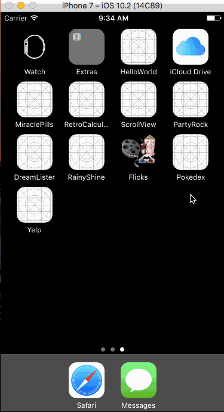

# Pokedex

##Description:
An app that displays a list of Pokemon, along with their information (e.g. bio and attack moves); written in Swift as a tutorial project for Devslopes. This app was built to learn the concepts of REST and web requests using Alamofire. Other concepts learned: UICollectionView, UIStackView, UISearchBar.

API Used: PokeApi

##Demo:

##Feature Added:
- Display Pokemon's attack moves